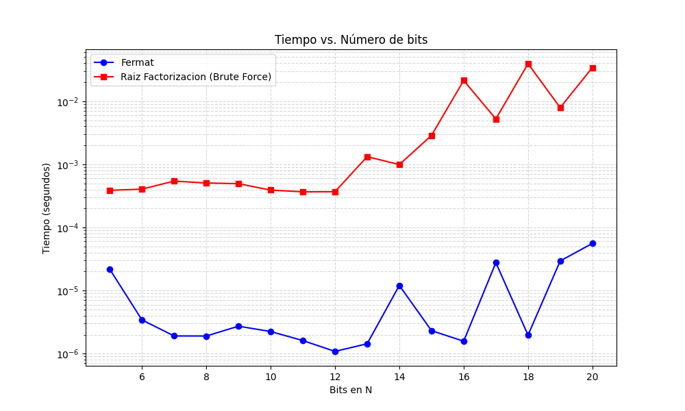

# Laboratorio 2

En este laboratorio se realizan implementaciones para el algoritmo de Fermat y de reducción de factorización a raíz cuadrada en el archivo `lab2.py`.

Se usa la librería `gmpy2` para trabajar con números enteros grandes con precisión y rapidez necesaria, puesto que Python tiene problemas de precisión al trabajar con números de gran cantidad de bits, usuales en criptografía.

## Fermat

La implementación del algoritmo de Fermat es directa. Se usan las operaciones `pow` y `mod` de `gmpy2` para mejor precisión y rapidez. Este permite encontrar `p` y `q`, primos de un número `n`.

## Reducción de factorización a raíz cuadrada.

Este algoritmo demuestra que resolver el problema de raíz cuadrada en aritmética modular es igual de difícil que factorizar un número. Una vez encuentre uno de los factores primos de `n`, el algoritmo se detiene. Se utiliza un oráculo de fuerza bruta, el cual itera desde 0 a n-1 para encontrar las posibles raíces del problema `x**2 = a mod n`. Esto hace que demore mucho más que el algoritmo de Fermat. En la práctica, la aleatoriedad de `y` hace que haya una posibilidad de no encontrar un los factores de `n`.

## Perfilado y comparación

En `profiling.py` se incluye un script para perfilar el rendimiento de ambos algoritmos frente a números de bits crecientes. Se nota cómo el algoritmo de Fermat resulta mucho más rápido en comparación al de reducción. Para 20 bits, hay una diferencia de hasta 3 magnitudes. En cambio, para Fermat, este dependerá principalmente de la diferencia entre `y2` y su raíz entera, siendo algunos números más fáciles de factorizar que otros, pero en general más rápido. Por lo tanto, un oráculo de fuerza bruta resulta impráctico con la reducción de factorización a raíz cuadrada y el algoritmo de Fermat más directo y sencillo de implementar.

