# Instalación de Kali Linux y uso de herramientas

Kali Linux es una distribución basada en Debian utilizada comúnmente por expertos en seguridad, tanto ofensiva como defensiva, por tener preinstalada un conjunto de herramientas para conducir ataques de penetración, análisis de red, monitoreo, fuzzing, etc.

## Instalación

Para instalar Kali Linux, simplemente se descarga la versión de VirtualBox de su página oficial y se abre en esta aplicación.

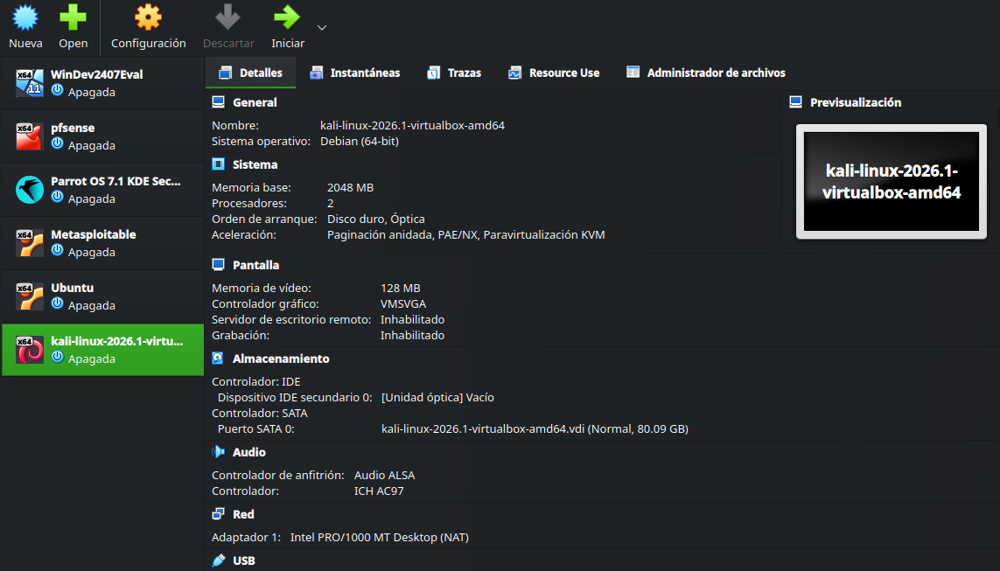

Para usar esta herramienta junto a la máquina de exploración Metasploitable, se configura una red interna a la que Kali y Metasploitable estarán conectadas.

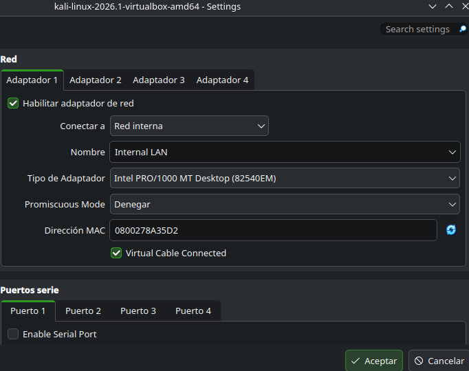

Con esto, tenemos un laboratorio funcional y protegido con el firewall pfSense.

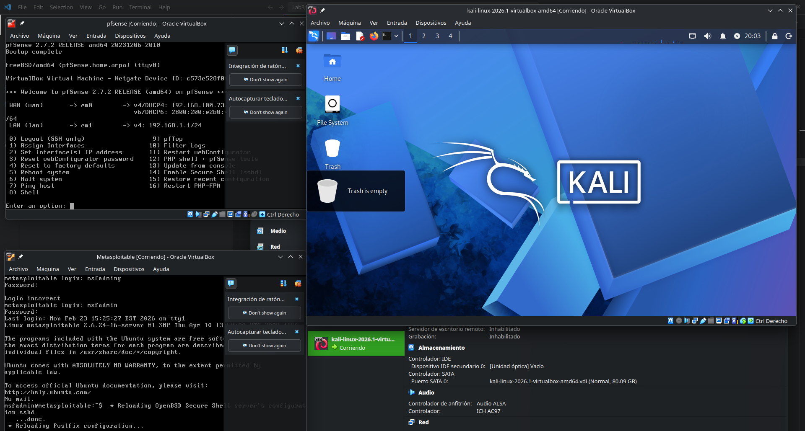

## Actualización

Siguiendo el tutorial, se actualiza la máquina Kali.

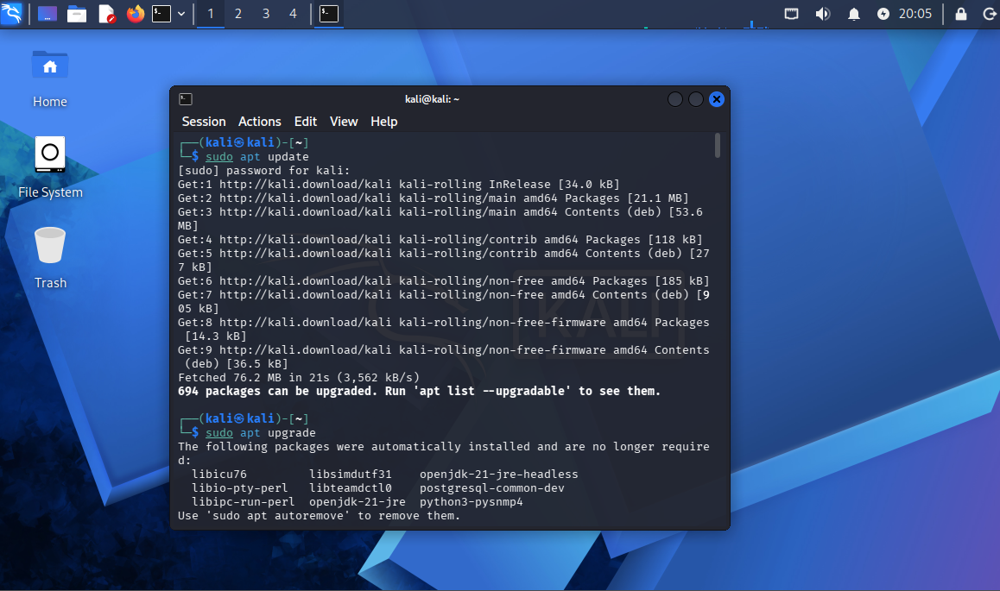

# Herramientas de recolección de información

## Nmap y Zenmap

Nmap es una herramienta para recolección de información de redes usada extensivamente en las auditorías de seguridad. Zenmap es una interfaz gráfica de Nmap, la cual solo tiene disponible una interfaz de línea de comandos.

### Detección de OS

Se usa el comando `nmap -O 192.168.1.101`. La dirección es la dirección de la máquina Metasploitable.

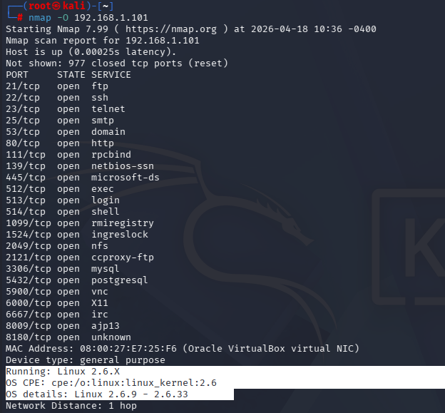

### Escaneo de puertos TCP

Se usa el comando `nmap -p 1-65535 -T4 192.168.1.101 `.

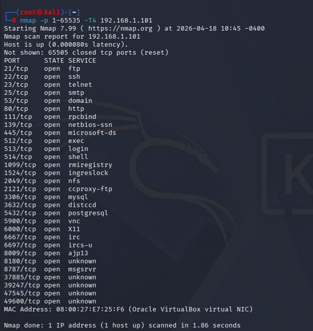

### Escano sigiloso (Stealth Scan)

Se realiza iniciando un 3-way handshake pero no terminándolo para que no quede registrado. Se usa el comando `nmap -sS -T4 192.168.1.101 `

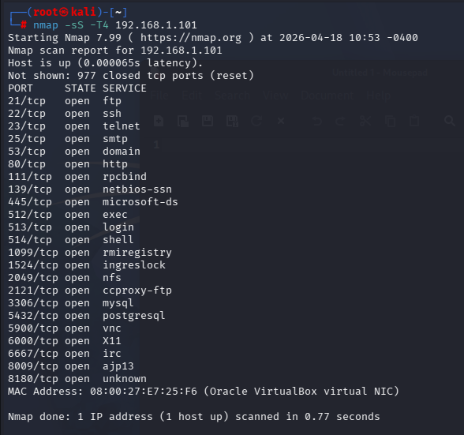

## Searchsploit

Searchsploit es una herramienta para buscar vulnerabilidades conocidas de `https://www.exploit-db.com/`. Solo se usa el comando con el término de búsqueda.

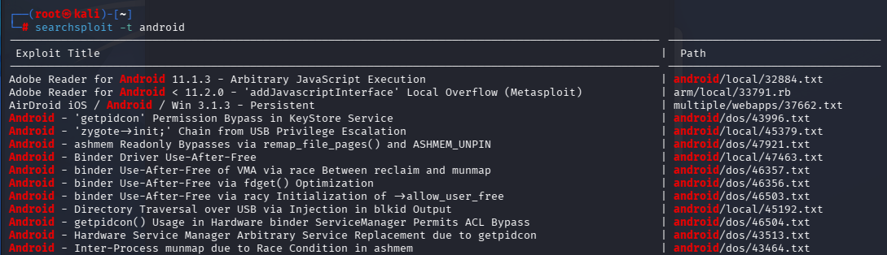

## Herramientas DNS

Es común investigar registros DNS durante la etapa de reconocimiento en una revisión de seguridad.

### dnsenum.pl

Este script permite recolectar información MX, A y otros tipos de registros de un dominio.

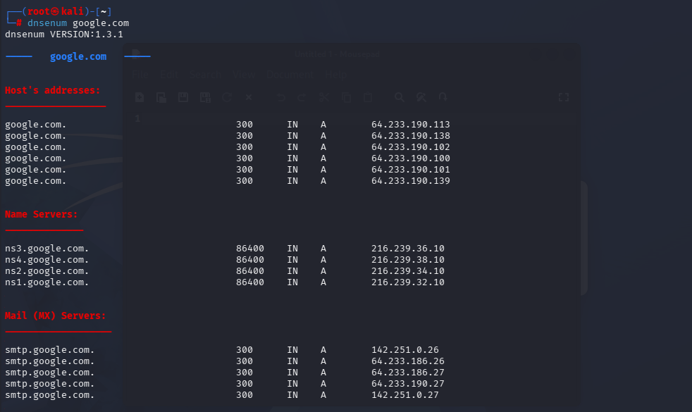

### dnsmap

Permite recolectar información adyacente a los registros, como números de contacto, correos electrónicos, etc.

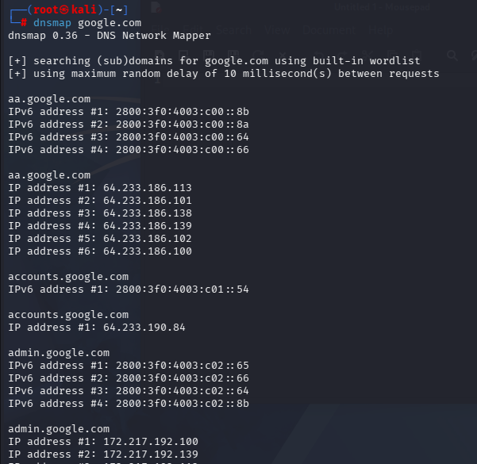

### dnstracer

Determina donde un DNS obtiene su información dado un host.

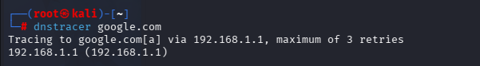

### lbd

Determina si un dominio utiliza un balanceador de carga.

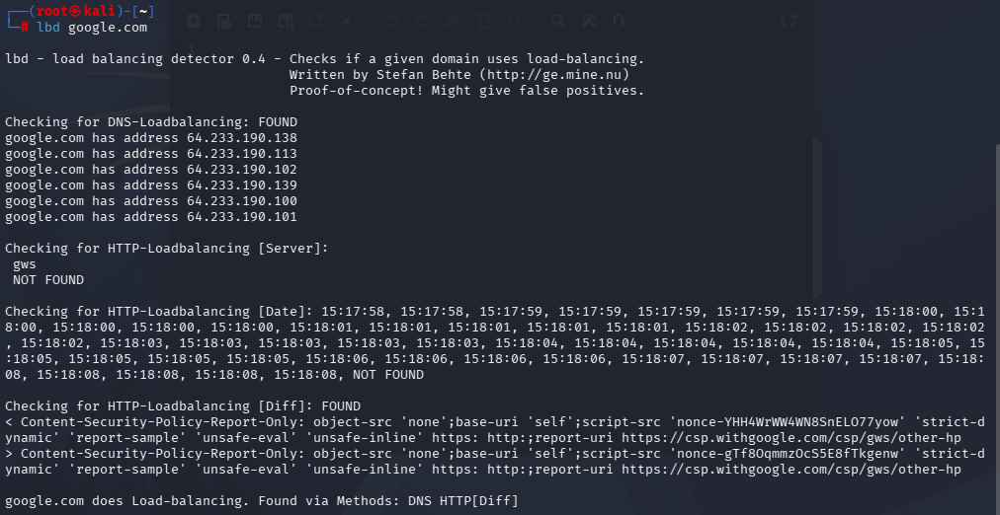

En este caso, `google.com` usa un balanceador de carga DNS.

## Hping3

Es una herramienta similar a `ping` pero con capacidades para bypassear firewalls y usar distintos protocolos.

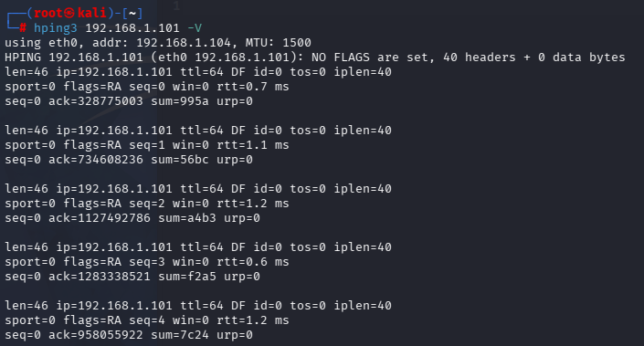

# Análisis de vulnerabilidades

Kali tiene herramientas para explotar vulnerabilidades.

## Herramientas Cisco

### cisco-torch

Esta herramienta permite reconocer, analizar y explotar dispositivos Cisco. Utilizándola en Metsaploitable, solo reconoce el servicio TFTP.

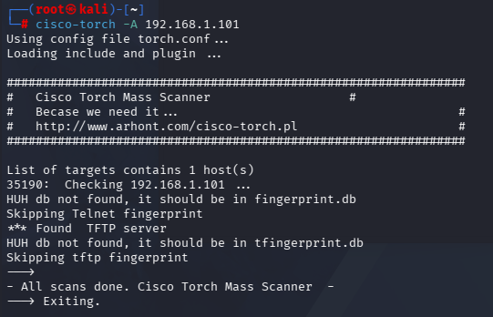

### Cisco Analysis Tool

Permite reconocer y analizar vulnerabilidades en dispositivos Cisco.

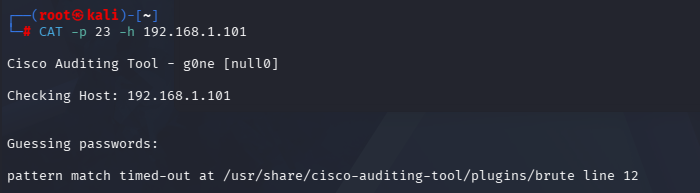

### BED

Permite reconocer vulnerabilidades comunes como buffer overflows, format strings, etc. Se puede usar con una dirección objetivo.

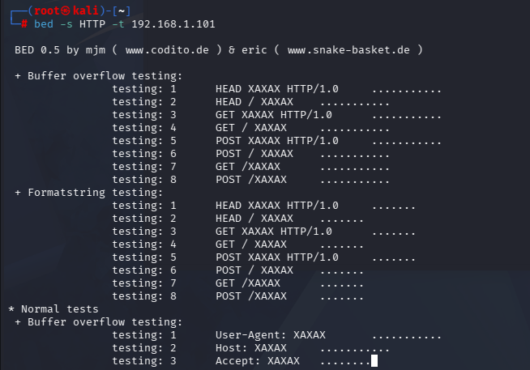